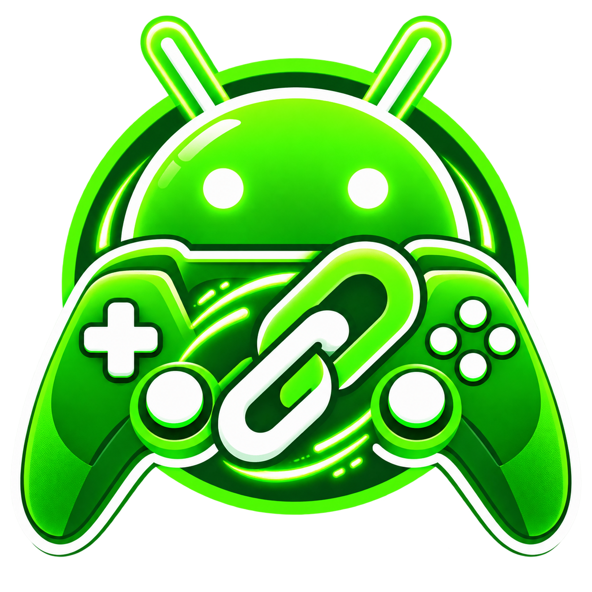

<div align="center">
  

# DroidLink

**Android-to-Android remote game streaming with low-latency video and controller transport.**

[](https://github.com/Aihoward/DroidLink)
[](https://kotlinlang.org/)
[](https://webrtc.org/)
[](LICENSE)
[](https://github.com/Aihoward/DroidLink/releases)

[Download the latest APK](https://github.com/Aihoward/DroidLink/releases) · [All releases](https://github.com/Aihoward/DroidLink/releases) · [Report an issue](https://github.com/Aihoward/DroidLink/issues)

</div>

## What is DroidLink?

DroidLink connects two Android devices for remote gameplay. The host shares game video and audio while the joining device receives the stream and sends controller input over WebRTC.

The project is currently in beta. Builds are published for physical-device testing, and previous releases remain available as rollback checkpoints.

## Features

- Android screen capture through MediaProjection
- Low-latency WebRTC video streaming
- H.264 hardware codec preference where supported
- Firebase Realtime Database room signaling
- Direct peer-to-peer connectivity with Cloudflare TURN fallback
- WebRTC DataChannel controller transport
- DroidLink Player 2 virtual controller integration
- Game-audio streaming through Android playback capture
- Adaptive bitrate, resolution, and frame-rate controls
- In-session connection, video, audio, and controller diagnostics

## Download

Install the newest APK from [GitHub Releases](https://github.com/Aihoward/DroidLink/releases). Releases marked **Pre-release** are beta/debug builds intended for testing.

> Android may warn about installing apps from outside Google Play. Only download DroidLink APKs from this official repository.

## Basic use

1. Install the same DroidLink version on both Android devices.
2. Select **Host Game** on the first device and grant screen-capture permission.
3. Share the six-digit room code.
4. Select **Join Game** on the second device and enter the code.
5. Connect a supported controller to the joining device.
6. Use the in-session menu for game audio, settings, and diagnostics.

## Technology

| Area | Implementation |
| --- | --- |
| App | Kotlin, Android, Jetpack Compose |
| Video | WebRTC, MediaProjection, SurfaceViewRenderer |
| Signaling | Firebase Realtime Database |
| NAT traversal | STUN and Cloudflare TURN |
| Input | WebRTC DataChannel |
| Game audio | Android playback capture |

## Beta notes

- Performance depends on both devices, the game, and network conditions.
- Android playback-capture policy may prevent game audio from certain apps.
- Controller injection compatibility varies by device, game, emulator, and permission environment.
- DroidLink does not claim to bypass Android platform restrictions.

## Building

Prerequisites include Android Studio with the required SDK/NDK, its bundled JDK, Firebase signaling configuration, and a configured TURN credential service.

```bash
./gradlew :app:testDebugUnitTest
./gradlew :app:assembleDebug
```

Local credentials, signing keys, TURN secrets, and `local.properties` must never be committed.

## Project status

DroidLink is under active beta development. Physical-device results are the source of truth for streaming, audio, controller compatibility, and latency behavior; a successful build alone does not prove those features on every device.

## Security and privacy

- Screen capture requires Android's MediaProjection consent.
- Temporary room/signaling metadata is stored in Firebase for the active session.
- Private Firebase, TURN, Cloudflare, and signing credentials must not be published.

## Contributing

Bug reports should include the DroidLink version, both device models and Android versions, connection type, relevant `DroidLink` Logcat messages, and clear reproduction steps.

Use [GitHub Issues](https://github.com/Aihoward/DroidLink/issues) for reproducible bugs and compatibility reports.

## License

DroidLink is open-source software released under the [MIT License](LICENSE).

---

<div align="center">
  <strong>DroidLink</strong><br>
  Built for Android-to-Android multiplayer testing.
</div>
